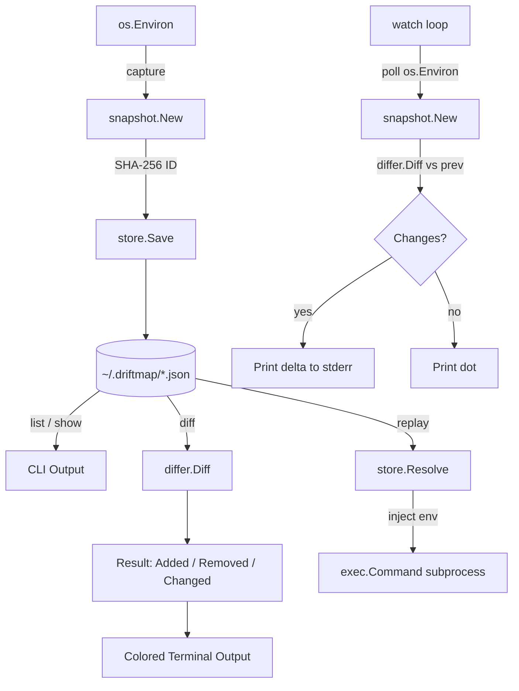

# driftmap

> **Capture, diff, and replay environment variable snapshots — expose config drift before it bites you.**

[](https://go.dev)
[](LICENSE)

*Created and scheduled by [hellohaven.ai](https://hellohaven.ai)*

---

## Why It Exists

Every developer has been burned by environment drift: a secret that exists in staging but not prod, a `DATABASE_URL` that silently changed, a feature flag that was set locally but never deployed. `driftmap` is a terminal-native tool that snapshots your environment at any point in time, lets you diff any two snapshots, replay an old environment into a subprocess, and watch for live changes in real-time.

No cloud. No agents. Just fast, local, cryptographically-identified snapshots stored in `~/.driftmap`.

---

## Features

- **`capture`** — Snapshot the current environment with an optional label
- **`diff`** — Compare any two snapshots (by ID, label, or alias like `latest`)
- **`list`** — Table view of all snapshots with timestamps and variable counts
- **`show`** — Inspect every variable in a snapshot
- **`replay`** — Run any command with a snapshot's environment injected as a clean subprocess
- **`watch`** — Poll and stream live environment changes to the terminal
- SHA-256 content-addressed snapshot IDs (tamper-evident)
- Fuzzy resolution: short IDs, labels, `latest`, `oldest`, `@-1` offsets

---

## Architecture



---

## How It Works

1. **Capture**: `os.Environ()` is parsed into a `map[string]string`. A SHA-256 hash of the timestamp + all key=value pairs produces a deterministic content-addressed ID. The snapshot is serialized to `~/.driftmap/<id>.json`.

2. **Diff**: Two snapshots are loaded, and the differ walks both maps: keys only in B are `Added`, keys only in A are `Removed`, and keys in both with different values are `Changed`.

3. **Replay**: The snapshot's vars are reconstructed into a `[]string` slice and injected as the sole environment for a new `exec.Command`. The current shell's environment is not inherited — the snapshot is the full environment.

4. **Watch**: A background loop captures a fresh snapshot every N seconds and diffs it against the previous. Only changes are printed, making the output scannable.

---

## Setup

### Prerequisites

- Go 1.21 or later
- Git

### Install

```bash
# Clone the repo
git clone https://github.com/DucChau/driftmap.git
cd driftmap

# Download dependencies
go mod download

# Build the binary
go build -o driftmap .

# Optionally install to your PATH
go install .
```

Or use the Makefile:

```bash
make build     # builds ./driftmap
make install   # installs to $GOPATH/bin
make test      # runs all tests
```

---

## Run Instructions

```bash
# Capture the current environment
./driftmap capture

# Capture with a label
./driftmap capture dev-baseline

# List all snapshots
./driftmap list

# Show a snapshot's variables (use short ID from list)
./driftmap show abc12345

# Diff two snapshots
./driftmap diff abc12345 def67890

# Diff using labels
./driftmap diff dev-baseline latest

# Diff using aliases
./driftmap diff oldest latest

# Replay a snapshot into a subprocess
./driftmap replay abc12345 -- env | grep DATABASE
./driftmap replay dev-baseline -- ./scripts/run-tests.sh

# Watch for live environment changes (polls every 2 seconds)
./driftmap watch

# Watch with a custom interval
./driftmap watch --interval 5
```

---

## Example Output

### `driftmap list`

```
ID            Captured At           Vars      Label
─────────────────────────────────────────────────────────
abc12345      2024-01-15T09:00:00Z  42        dev-baseline
def67890      2024-01-15T14:30:00Z  45        after-deploy
```

### `driftmap diff dev-baseline after-deploy`

```
Diff: abc12345 → def67890

+ ADDED (3 added)
  + NEW_FEATURE_FLAG=true
  + STRIPE_WEBHOOK_SECRET=whsec_...
  + REDIS_URL=redis://localhost:6379

- REMOVED (1 removed)
  - OLD_API_KEY=sk_test_...

~ CHANGED (1 changed)
  ~ DATABASE_POOL_SIZE
    - 5
    + 20
```

### `driftmap watch`

```
◉ Watching environment every 2s (Ctrl+C to stop)
· [09:00:02] no changes
· [09:00:04] no changes
▲ [09:00:06] 1 change(s) detected:
  + NEW_VAR=hello
```

---

## Project Structure

```
driftmap/
├── main.go                      # Entrypoint
├── go.mod
├── go.sum
├── Makefile
├── cmd/
│   ├── root.go                  # Cobra root command + banner
│   ├── capture.go               # driftmap capture
│   ├── diff.go                  # driftmap diff
│   ├── list.go                  # driftmap list
│   ├── show.go                  # driftmap show
│   ├── replay.go                # driftmap replay
│   └── watch.go                 # driftmap watch
└── internal/
    ├── snapshot/
    │   ├── snapshot.go          # Snapshot type + SHA-256 ID generation
    │   └── snapshot_test.go
    ├── store/
    │   └── store.go             # Disk persistence in ~/.driftmap
    └── differ/
        ├── differ.go            # Added/Removed/Changed diff logic
        └── differ_test.go
```

---

## Future Improvements

- **Export/import**: Share snapshots as `.env` files or JSON between teammates
- **Redaction**: Automatically mask secrets matching patterns (e.g., `*_KEY`, `*_SECRET`)
- **Annotations**: Attach freeform notes to snapshots
- **Named environments**: Tag snapshots with `dev`, `staging`, `prod` and diff by environment name
- **Git integration**: Auto-capture on `git checkout` via a hook installer
- **TUI**: An interactive terminal UI built with Bubble Tea for browsing and diffing snapshots
- **Remote sync**: Optional encrypted sync to S3 or a self-hosted endpoint

---

## License

MIT — see [LICENSE](LICENSE)
